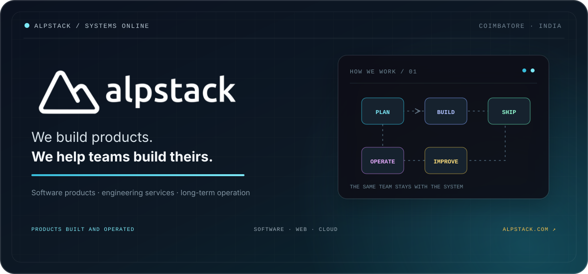
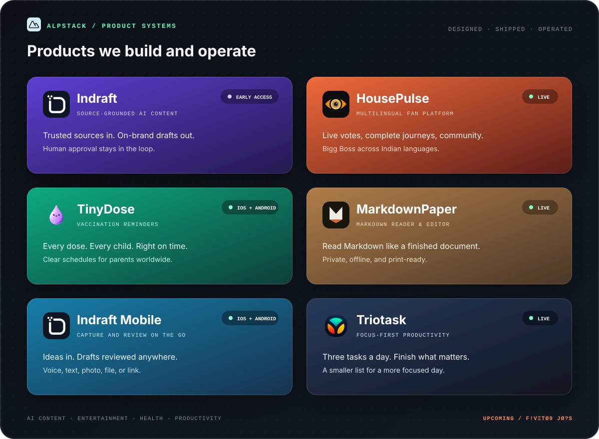
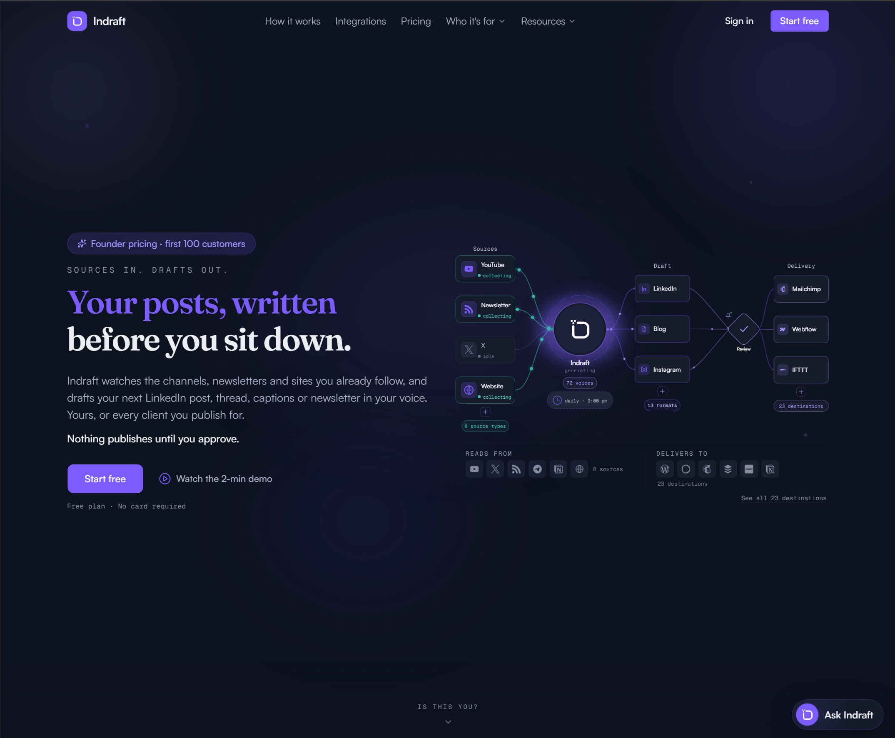
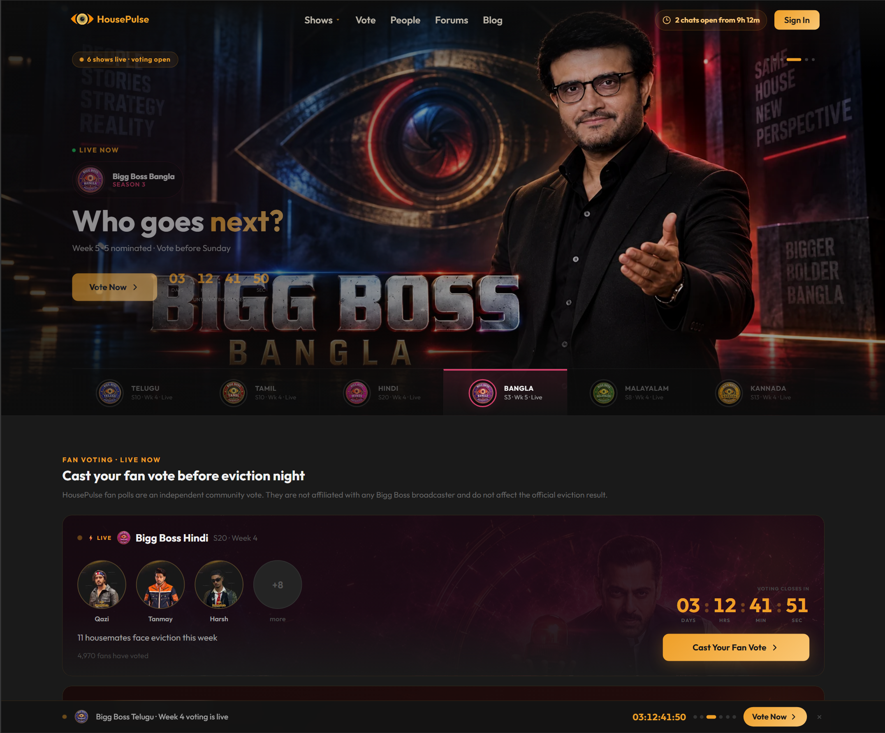
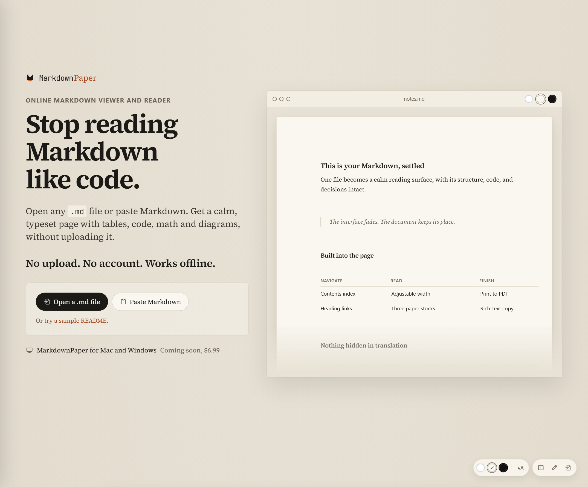
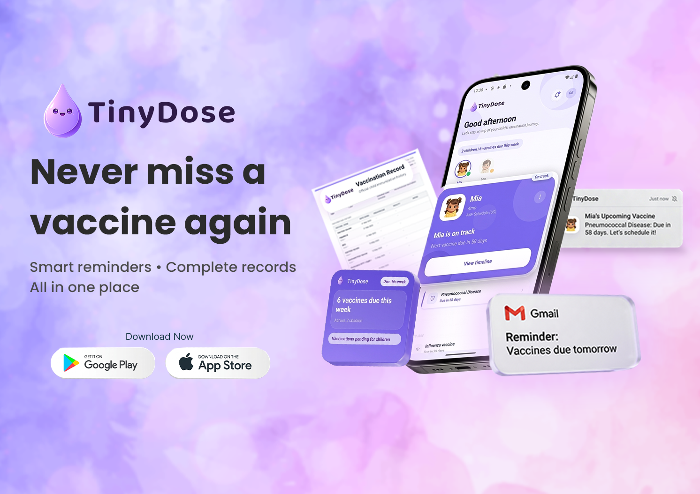
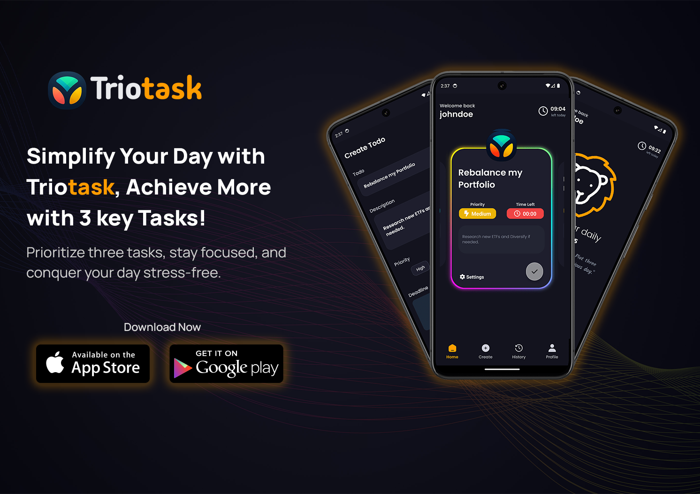

# Alpstack Technologies

We build our own software products and help other teams ship theirs. Alpstack is an independent engineering studio based in Coimbatore, India, working with founders and product teams worldwide.

Our work covers product development, web platforms, mobile apps, cloud infrastructure, architecture, and technical direction. We stay involved after launch because reliable software needs more than a release date.

  
  
  
  
  

## Products we build and operate

### See the products

<table>
<tr>
<td width="50%" valign="top">

 <strong>Indraft</strong> · Sources in. Reviewable drafts out.
</td>
<td width="50%" valign="top">

 <strong>Indraft Mobile</strong> · Capture, run, and review from your phone.
</td>
</tr>
<tr>
<td width="50%" valign="top">

 <strong>HousePulse</strong> · Live voting, contestant journeys, and community.
</td>
<td width="50%" valign="top">

 <strong>MarkdownPaper</strong> · A calmer way to read Markdown.
</td>
</tr>
<tr>
<td width="50%" valign="top">

 <strong>TinyDose</strong> · Vaccination schedules, records, and reminders.
</td>
<td width="50%" valign="top">

 <strong>Triotask</strong> · Three important tasks. One focused day.
</td>
</tr>
</table>

### Available now

- **[Indraft](https://indraft.pub)** · `early access`: Watches trusted sources and prepares blogs, newsletters, posts, and scripts in your brand voice. Every draft keeps its sources and waits for review.
- **Indraft Mobile** · `iOS + Android`: Capture ideas by voice, text, photo, file, or link, then run and review Indraft workflows from your phone. [App Store](https://apps.apple.com/in/app/indraft-ai-content-writer/id6794631258) · [Google Play](https://play.google.com/store/apps/details?id=com.alpstack.indraft)
- **[HousePulse](https://housepulse.in)** · `live`: A multilingual Bigg Boss fan platform with voting, contestant profiles, season archives, editorial coverage, and community features.
- **[TinyDose](https://alpstack.com/tinydose)** · `iOS + Android`: Vaccination schedules, records, and reminders for parents. [App Store](https://apps.apple.com/in/app/tinydose-baby-vaccine-tracker/id6762482872) · [Google Play](https://play.google.com/store/apps/details?id=com.alpstack.tinydose)
- **[MarkdownPaper](https://markdownpaper.app)** · `live`: A private Markdown reader and editor with GitHub Flavored Markdown, code highlighting, math, diagrams, offline support, and PDF export.
- **[Triotask](https://alpstack.com/triotask)** · `live`: A focus-first task app that keeps each day to three important tasks.

### In development

`CЯ∆V?` · street-food discovery  
`F!VΞTØ9 JØ?S` · flexible and part-time work  
`HØUSΞØF∆P!S` · APIs and utilities for developers

The names stay obscured until each product is ready. There are no preview links yet.

**[Explore the complete product portfolio](https://alpstack.com/products)**

## Engineering services

| Service | What we do |
|---|---|
| **[Software development](https://alpstack.com/software-development)** | System design, backend services, APIs, integrations, web applications, delivery pipelines, documentation, and handover. |
| **[Web development](https://alpstack.com/web-development)** | Marketing sites, content platforms, web applications, and dashboards built for performance, accessibility, responsive use, and search. |
| **[Software consulting](https://alpstack.com/software-consulting)** | Clear decisions about architecture, scaling, technology selection, delivery, due diligence, and build-versus-buy choices. |
| **[Cloud computing](https://alpstack.com/cloud-computing)** | AWS and edge infrastructure, CI/CD, monitoring, logs, alerts, performance improvements, reliability, and cost control. |
| **[Engineering mentoring](https://alpstack.com/mentoring)** | Practical sessions using real code, current architecture, debugging, testing, system design, and delivery decisions. |
| **[Technical interviewing](https://alpstack.com/technical-interviewing)** | Role-specific interviews, consistent scoring rubrics, technical evaluation, and written hiring recommendations. |

**[See all services](https://alpstack.com/services)** · **[Discuss a project](https://alpstack.com/contact)**

## Free tools and resources

| Resource | What it helps with |
|---|---|
| **[Product launch sites](https://alpstack.com/product-launch-sites)** | Browse launch boards, communities, marketplaces, directories, and developer ecosystems. |
| **[Launch planner](https://alpstack.com/product-launch-sites/plan)** | Build a dated launch plan around your product, audience, and target regions. |
| **[Launch board](https://alpstack.com/product-launch-sites/board)** | Discover products that are launching now. |
| **[Launch readiness check](https://alpstack.com/product-launch-sites/check)** | Check a product page before sending launch traffic to it. |
| **[Baby vaccination calculator](https://alpstack.com/tinydose/schedule-calculator)** | Turn a child's date of birth into vaccination dates across official schedules. |
| **[Vaccine guide](https://alpstack.com/tinydose/vaccines)** | Read practical information about vaccines and the diseases they prevent. |

## How we work

- **Build and operate:** Launch is the start. We monitor products, support users, fix problems, and keep improving the system.
- **Keep systems understandable:** Clear architecture and maintainable code beat unnecessary complexity.
- **Ship useful steps:** Teams see working software early, so decisions come from real use instead of long assumptions.
- **Explain trade-offs:** Recommendations include the cost, risk, and practical reason behind the choice.

## Technology

| Area | Tools we use |
|---|---|
| **Web and product** | TypeScript · JavaScript · React · Next.js · React Native · Node.js |
| **Backend and data** | Go · Python · PostgreSQL · MongoDB · DynamoDB · REST APIs |
| **Cloud and delivery** | AWS · Kubernetes · Docker · Terraform · Argo CD · CI/CD |
| **Web infrastructure** | Vercel · Cloudflare · Serverless · Observability · Technical SEO |

## Founder-led

Alpstack was founded by **[Renish Bhaskaran](https://renish.me)**, a software architect and cloud engineer with more than 14 years of experience across enterprise platforms, Kubernetes infrastructure, web and mobile products, and product engineering.

Renish has also mentored more than 190 engineers through Springboard and CareerFoundry, working across full-stack development, AWS, Python, Django, architecture, code review, and system design.

[GitHub](https://github.com/renishb10) · [LinkedIn](https://www.linkedin.com/in/renishb) · [Personal site](https://renish.me)

 

## Work with Alpstack

Tell us what you are building, what already exists, and where the work is stuck. We will suggest a useful first step.

**[Start a conversation](https://alpstack.com/contact)** or email **[howdy@alpstack.com](mailto:howdy@alpstack.com)**.

---

[**Website**](https://alpstack.com) &nbsp;·&nbsp; [**Products**](https://alpstack.com/products) &nbsp;·&nbsp; [**Blog**](https://alpstack.com/blog) &nbsp;·&nbsp; [**Insights**](https://alpstack.com/insights) &nbsp;·&nbsp; [**LinkedIn**](https://www.linkedin.com/company/alpstack-technologies)

Coimbatore, India · working with teams worldwide

